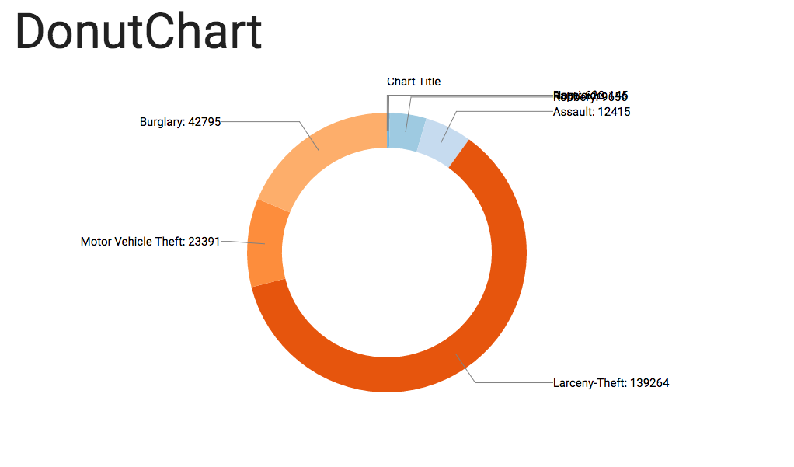

# DonutChart API Documentation
### INFO474 A3-software-design

## Usage
The DonutChart API is a simple API people can leverage to create similar data visualization like:


The API works great for datasets where a single key is associated with its only value. Some data aggregation may be required in data preparation.  

The following function works great for data aggregation, just simply replace `key` with the name of attribute you want to aggregate and the `value` to the name of attribute that represents the value associated to the `key`:  

```javascript
var prepData = d3.nest()
			.key(function(d) { return d.key; })
			.rollup(function(d) {
				return d3.sum(d, function(g) { return g.value; });
			}).entries(data);
```

## API Functions
\# *DonutChart*()
> Constructs a donut chart object with the default variables.

\# *DonutChart*.**width**(value)
> Sets the width of the donut chart. If the value is not specified, return the current value.  
> **Default: `960`**

\# *DonutChart*.**height**(value)
> Sets the height of the donut chart. If the value is not specified, return the current value.  
> **Default: `450`**

\# *DonutChart*.**radius**(value)
> Sets the radius of the donut chart. If the value is not specified, return the current value.  
> **Default: `Math.min(width, height) / 2`**

\# *DonutChart*.**color**(value)
> Sets the color scheme (array of colors) for the slices of the donut chat. If the value is not specified, return the current value.  
> **Default: `d3.schemeCategory20c`**

\# *DonutChart*.**title**(value)
> Sets the title of the donut chart. If the value is not specified, return the current value.  
> **Default: `'chart title'`**


